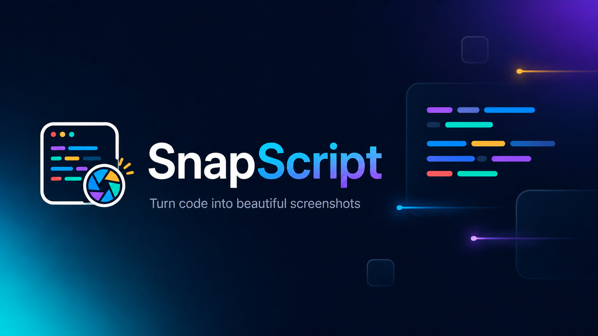

# SnapScript

**Beautiful code screenshots, straight from your desktop.**

SnapScript is a lightweight offline desktop app for turning code snippets into polished PNG images for documentation, presentations, blog posts, social media, chats, pull requests, and bug reports.

[Download latest release](../../releases/latest)

## Preview

## Why Use SnapScript

SnapScript is a fast local alternative to browser-based code screenshot tools like Carbon.now.sh. It keeps the whole flow on your machine: capture code, style it, export it, and share it.

Use it when you need:

- Clean code screenshots for presentations and slides.
- Polished snippet images for X, LinkedIn, Discord, Telegram, or blog posts.
- Readable code examples for READMEs, documentation, tutorials, and release notes.
- A quick way to copy selected code as a beautiful PNG without opening a website.

## How To Use

1. Download SnapScript from the [Releases page](../../releases/latest).
2. Run the app and keep it open or minimized to the system tray.
3. Select code in your editor, terminal, browser, or documentation.
4. Press the capture hotkey.
5. Edit the snippet directly in the preview if needed.
6. Pick a language, theme, background, title bar, line height, and export mode.
7. Save the image as PNG or copy it straight to your clipboard.

## Features

- Global hotkey capture for selected code.
- Editable CodeMirror preview with automatic language detection.
- Manual language selection with 140+ CodeMirror languages.
- Popular IDE themes: Darcula, Dracula, GitHub, Material, Monokai, Nord, One Dark, Tokyo Night, VS Code, Solarized, Xcode, and more.
- Markdown preview mode for rendered documentation snippets.
- Gradient and solid backgrounds for posts, docs, and presentation slides.
- `Only code` mode for exporting just the snippet.
- Editable file tab, optional title bar, optional line numbers, and line height control.
- Save as PNG or copy PNG to clipboard.
- Local rendering. Your code does not need to leave your computer.

## Good For

- Social media code cards.
- Conference talks and lessons.
- Technical blog posts.
- Product changelogs.
- Documentation examples.
- Pull request notes and issue reports.
- Chat messages where formatting matters.

## Privacy

SnapScript renders screenshots locally. Your code snippets do not need to be uploaded to an online screenshot service.

## License

SnapScript is released under the GPL-3.0 license.
