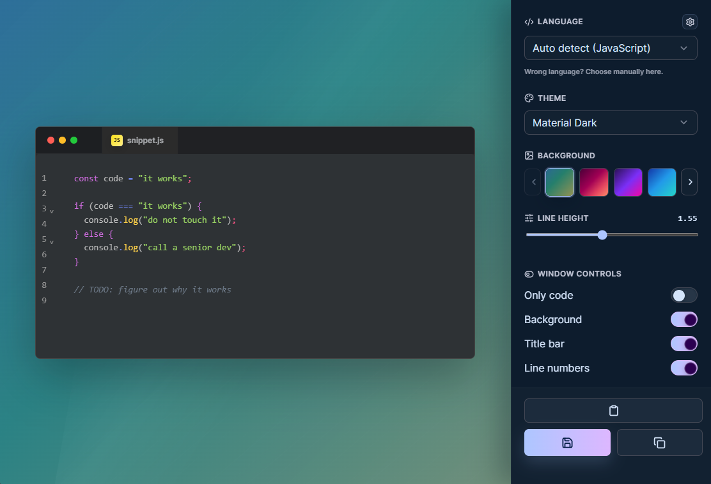

# CodeSnap

Beautiful code screenshots, straight from your desktop.

CodeSnap is a lightweight desktop app for turning code snippets into polished PNG images. It is a fast, offline alternative to web tools like Carbon.now.sh, built for developers who share code in documentation, presentations, blog posts, social media, chats, pull requests, and bug reports.

No upload. No browser tab. No reformatting the same snippet five times. Just select code, press a hotkey, and get a clean image that looks ready to publish.

## Preview

## Why CodeSnap

Code looks great in your editor. Then you paste it into a chat, a slide deck, a README, or a social post, and suddenly it looks like it fell down the stairs.

CodeSnap fixes that small but very real developer annoyance. It gives you a native code screenshot tool that keeps the workflow local, fast, and repeatable.

Use it when you need:

- A crisp code screenshot for a technical presentation.
- A clean snippet image for X, LinkedIn, Telegram, Discord, or a blog post.
- A polished code block for documentation, tutorials, course material, and release notes.
- A readable bug report screenshot without losing syntax highlighting.
- A local Carbon.now.sh alternative that works offline.
- A quick way to copy selected code into a beautiful PNG without opening a website.

## How It Works

1. Select code in your editor, terminal, browser, or docs.
2. Press the global capture hotkey.
3. CodeSnap opens with the snippet already loaded.
4. Pick a language, IDE theme, background, title bar, line height, and export mode.
5. Save the PNG or copy the image directly to your clipboard.

For quick edits, the code stays editable right inside the preview. Fix a typo, rename the file tab, change the language, switch themes, export, done.

## Highlights

- **Instant code screenshots**  
  Capture selected text with a hotkey and turn it into a PNG in seconds.

- **Local-first and offline**  
  Your code is rendered on your machine. No online screenshot service is required.

- **Professional syntax highlighting**  
  Powered by CodeMirror with automatic language detection and manual override.

- **Large language catalog**  
  Supports the CodeMirror language catalog, including 140+ languages and plain text.

- **Popular IDE themes**  
  Includes Darcula, Dracula, GitHub Dark, GitHub Light, Material Dark, Monokai, Nord, One Dark, Tokyo Night, VS Code Dark, Atom One, Sublime, Solarized, Xcode, and Quiet Light.

- **Markdown preview**  
  Render Markdown as a real preview instead of plain text when you want documentation-style screenshots.

- **Presentation-ready backgrounds**  
  Choose from solid colors and polished gradients for slides, posts, docs, and landing pages.

- **Only Code mode**  
  Export just the code block without the surrounding background or window chrome.

- **Editable file tab**  
  Rename the title in the code window so your screenshot looks intentional.

- **Tray workflow**  
  Keep CodeSnap in the system tray and bring it up only when you need it.

- **Save or copy**  
  Export to PNG or copy the image straight to the clipboard for quick sharing.

## Built For Real Developer Sharing

CodeSnap is useful anywhere code needs to look sharp outside the editor.

### Social Posts

Post readable code snippets without fighting formatting, screenshots, or browser-based design tools. Great for short tips, bug stories, release announcements, and “today I learned” posts.

### Presentations

Drop clean code images into slides without blurry editor screenshots, awkward crops, or giant UI panels around the snippet.

### Documentation

Make examples easier to scan in READMEs, docs pages, tutorials, changelogs, and internal knowledge bases.

### Chat and Support

Send readable snippets in Discord, Slack, Telegram, GitHub issues, and support threads without losing syntax highlighting.

### Blog Posts and Tutorials

Create consistent code cards for technical writing, courses, walkthroughs, and product updates.

## Why Not Just Use a Website?

Web-based code screenshot tools are great until they slow down your flow:

- You need to open a site.
- You paste code into a browser.
- You reselect theme, background, padding, and language.
- You download the image.
- You drag it back into the place where you actually needed it.

CodeSnap keeps that workflow on your desktop. It is faster, private by default, available offline, and designed to sit quietly in the tray until your hotkey calls it.

## Download

Get the latest build from the [Releases page](../../releases/latest).

Download CodeSnap for your operating system, run it, select some code, and make your first screenshot.

## Privacy

CodeSnap renders your code screenshots locally. Your snippets do not need to be uploaded to a website to become beautiful images.

## License

CodeSnap is released under the GPL-3.0 license.
